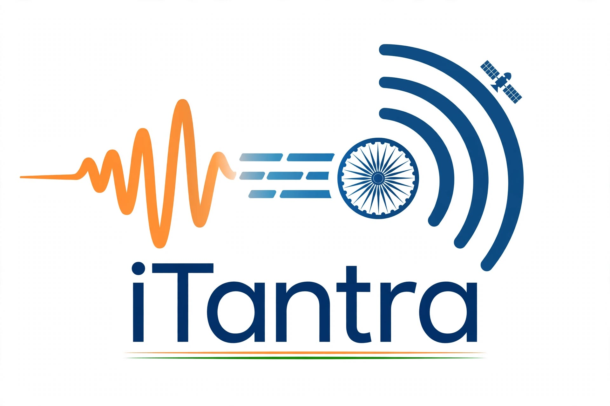

<p align="center">
  
</p>

<h1 align="center">iTantra (इ-तन्त्र)</h1>

<p align="center">
  <strong>Offline-First Peer-to-Peer Multilingual Voice Communicator for Android</strong><br>
  <em>Real-time voice-to-text-to-voice communication across 10 Indian languages without cellular data, internet, or cloud infrastructure.</em>
</p>

<p align="center">
  
  
  
  
  
  
</p>

---

## 📌 Overview

**iTantra** is a mission-critical, zero-cloud Android communication system engineered for defense, disaster management, remote exploration, and field operations where cellular towers and satellite internet are compromised or unavailable.

Instead of streaming heavy raw audio over fragile radio frequencies, iTantra transcribes human speech into text locally, translates it into the recipient's chosen dialect, transmits ultra-compact micro-text packets over direct peer-to-peer wireless links (Wi-Fi Direct / Bluetooth), and resynthesizes natural, audible speech on the receiving terminal.

---

## ✨ Key Features

| Feature | Description |
| :--- | :--- |
| 🎙️ **Zero-Cloud STT** | 100% on-device local Speech-to-Text inference. Voice never leaves the device as raw audio. |
| 🌐 **10 Indian Languages** | Real-time bidirectional translation across Hindi, Gujarati, Marathi, Kannada, Malayalam, Tamil, Telugu, Odia, Bengali, and English. |
| 🔊 **Persona-Adaptive TTS** | Dynamic voice profile tuning with selectable **👦 Boy** (low pitch, rapid delivery) and **👧 Girl** (bright pitch, melodic contour) speaker voices. |
| 📡 **Hybrid P2P Mesh** | High-throughput **Wi-Fi Direct** raw TCP socket pipeline with automatic **Bluetooth Classic (RFCOMM)** fallback. |
| 📻 **Dual Comm Modes** | **Walkie-Talkie (PTT)** with instant release latch, and **Continuous Hands-Free** mode with silence detection (450ms). |
| 🚨 **Tactical Emergency Alert** | High-priority SOS broadcast that overrides silent/vibrate modes, locks volume to maximum (`STREAM_ALARM`), and forces immediate acoustic playback. |
| ⚡ **Micro-Text Transmission** | Payloads are strictly under **256 bytes**, guaranteeing delivery over noisy, lossy, low-signal radio channels. |
| 🛡️ **Zero Telemetry / Absolute Privacy** | No remote servers, no analytics, no external tracking SDKs, and zero internet permissions required. |

---

## 🏗️ Architectural Flow

```
[ PHONE A (Sender) ]                                             [ PHONE B (Receiver) ]
┌─────────────────────────┐                                      ┌─────────────────────────┐
│  🎙️ Human Speech Input  │                                      │  🔊 Natural Voice Out   │
└────────────┬────────────┘                                      └────────────▲────────────┘
             │                                                                │
             ▼                                                                │
┌─────────────────────────┐                                      ┌─────────────────────────┐
│  Local On-Device STT    │                                      │  Local On-Device TTS    │
│  (Speech-to-Text)       │                                      │  (Boy / Girl Profiles)  │
└────────────┬────────────┘                                      └────────────▲────────────┘
             │                                                                │
             ▼                                                                │
┌─────────────────────────┐                                      ┌─────────────────────────┐
│  On-Device Translation  │                                      │  Incoming Packet Parser │
│  (e.g., Hindi -> Tamil) │                                      │  & Checksum Validator   │
└────────────┬────────────┘                                      └────────────▲────────────┘
             │                                                                │
             ▼                                                                │
┌─────────────────────────┐          P2P Air Interface           ┌────────────┴────────────┐
│  Compact Packet Builder │ ───────────────────────────────────► │  Wi-Fi Direct / BT      │
│  (<256 Bytes JSON)      │   Wi-Fi Direct / Bluetooth RFCOMM    │  Socket Receiver        │
└─────────────────────────┘                                      └─────────────────────────┘
```

---

## 📡 Transmission Protocol

iTantra enforces a minimal, deterministic packet envelope to ensure sub-50ms link latency:

```json
{
  "message_id": "c4b92a10-2f3b-4890-87ef-31e28976b92a",
  "lang_code": "hi",
  "priority": "NORMAL",
  "seq": 42,
  "text": "सुरक्षित क्षेत्र में पहुँचें",
  "checksum": 48291
}
```

* **Priorities:** `NORMAL` (standard message) | `ALERT` (emergency override).
* **Language Codes:** `hi`, `gu`, `mr`, `kn`, `ml`, `ta`, `te`, `or`, `bn`, `en`.

---

## 📱 User Interface Highlights

- **Dynamic Voice Selector:** One-tap toggle between **👦 Boy** and **👧 Girl** synthesized voices.
- **Audio Replay Button:** Instant `🔊 Replay` button on both sent and received conversation cards.
- **PTT Mic Button:** Interactive tactile feedback with visual pulse waves during audio capture.
- **Connection Manager:** Real-time peer discovery, signal status, and IP endpoint mapping.

---

## ⚙️ Hardware & Device Requirements

- **Operating System:** Android 8.0 (Oreo) or higher (API level 26+).
- **RAM Footprint:** Optimized for low-cost hardware (2 GB – 3 GB total RAM, runs well under 150 MB heap).
- **Sensors & Peripherals:** Microphone, Speaker, Wi-Fi Direct hardware support, and Bluetooth adapter.
- **Storage:** Lightweight APK footprint (~21 MB).

---

## 🛠️ Build and Setup

### Prerequisites
- [Android Studio Ladybug | 2024.2+](https://developer.android.com/studio)
- JDK 17 or higher
- Android SDK Platform 35, Build-Tools 35.0.0

### Step 1: Clone the Repository
```bash
git clone https://github.com/Sumit5-si/iTantra.git
cd iTantra
```

### Step 2: Open in Android Studio
Open the project root directory in Android Studio. Gradle will automatically sync project dependencies.

### Step 3: Build Debug / Release APK
```bash
# Debug build
./gradlew assembleDebug

# Release build
./gradlew assembleRelease
```
The compiled APK will be generated at `app/build/outputs/apk/`.

---

## 📁 Repository Structure

```
iTantra/
├── app/
│   ├── src/
│   │   └── main/
│   │       ├── java/com/itantra/app/
│   │       │   ├── communication/      # Wi-Fi Direct & Bluetooth Classic P2P sockets
│   │       │   ├── data/               # Room database, message entities & repositories
│   │       │   ├── di/                 # Dependency injection modules
│   │       │   ├── translation/        # Offline dictionary & neural translation engine
│   │       │   ├── ui/                 # Jetpack Compose UI (HomeScreen, Theme, Cards)
│   │       │   ├── voice/
│   │       │   │   ├── stt/            # Offline Speech-to-Text & VAD capture logic
│   │       │   │   └── tts/            # Offline Text-to-Speech & Voice Persona engine
│   │       │   └── MainActivity.kt     # App entry point & permission orchestrator
│   │       ├── res/
│   │       │   └── drawable/           # App icons, vectors, and iTantra logo
│   │       └── AndroidManifest.xml     # Offline permissions & service declarations
│   └── build.gradle.kts
├── gradle/
├── build.gradle.kts
└── README.md
```

---

## 🔒 Security & Privacy

1. **Zero External Requests:** The application contains no HTTP client libraries (`okhttp`, `retrofit`, etc.) and does not bind to internet-facing public endpoints.
2. **Ephemeral Local Cache:** Messages are stored in a sandboxed SQLite database on-device and can be purged at any moment.
3. **RF Footprint Reduction:** Because voice data is reduced to concise text packets before transmission, transmission bursts last milliseconds, minimizing RF interceptibility.

---

## 📄 License

This project is licensed under the [MIT License](LICENSE).
